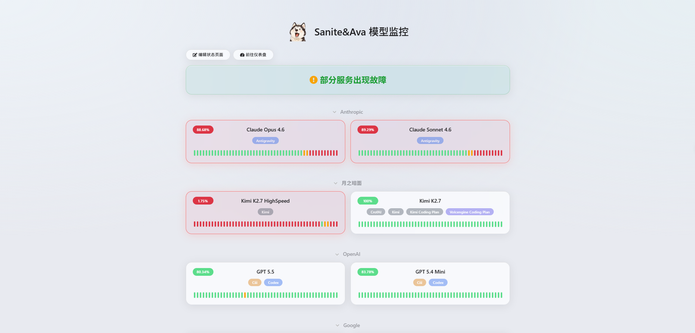
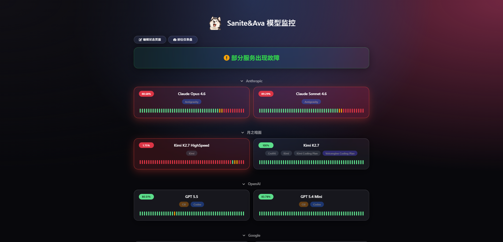

# Uptime Kuma Glass Theme

一款为 [Uptime Kuma](https://github.com/louislam/uptime-kuma) 公开状态页打造的 **毛玻璃风格** 自定义主题。

纯净、优雅、深浅色自适应，零依赖，纯 CSS 实现。

---

## ✨ 特性

- 🎨 **毛玻璃质感** — 所有卡片、按钮采用 backdrop-filter 玻璃拟态
- 🌗 **深浅色自适应** — 自动跟随 Uptime Kuma 的暗色/亮色模式
- 📐 **卡片居中布局** — 服务卡片自适应换行，始终居中排列
- 🏷️ **标签胶囊化** — 标签居中显示，保留原始颜色，胶囊圆角
- 🔴 **故障智能置顶** — 故障服务自动高亮，故障分组自动置顶，恢复后自动归位
- 🖱️ **交互微动效** — 悬停浮起、缩放、颜色渐变
- 📱 **响应式适配** — 移动端自动单列
- ⚡ **纯 CSS** — 无需修改任何源码，粘贴即用

---

## 📸 截图

### 亮色模式



### 暗色模式



### 奇数卡片样式


---

## 🚀 使用方法

1. 进入 Uptime Kuma 后台
2. 打开 **设置 → 外观 → 自定义 CSS**
3. 将 [`main.css`](./main.css) 的全部内容粘贴进去
4. 保存，刷新状态页即可生效

---

## 📋 卡片布局说明


- **左上角** — 状态徽章（正常 / 故障）
- **居中** — 服务名称
- **居中** — 标签（半透明胶囊，保留原始颜色）
- **底部** — 心跳条，占满整行宽度

---

## 🎯 智能故障处理

### 卡片级别

- 故障卡片自动高亮为红色边框 + 红色背景
- 故障卡片在分组内自动置顶

### 分组级别

- 含故障服务的分组自动移至页面最顶部
- 所有故障恢复后，分组自动退回原位

> 全部基于 CSS `:has()` 选择器，无需任何脚本。

---

## 📁 项目结构

```
.
├── style.css # 主题 CSS
├── README.md # 说明文档
└── screenshots/
 ├── light.png # 亮色截图
 └── dark.png # 暗色截图
```

---

## 📝 备注

- 兼容 Uptime Kuma 2.x 状态页
- 推荐使用 Chromium 内核浏览器（Chrome / Edge / Arc）以获得最佳 `backdrop-filter` 效果
- Firefox 需在 `about:config` 中开启 `layout.css.backdrop-filter.enabled`
